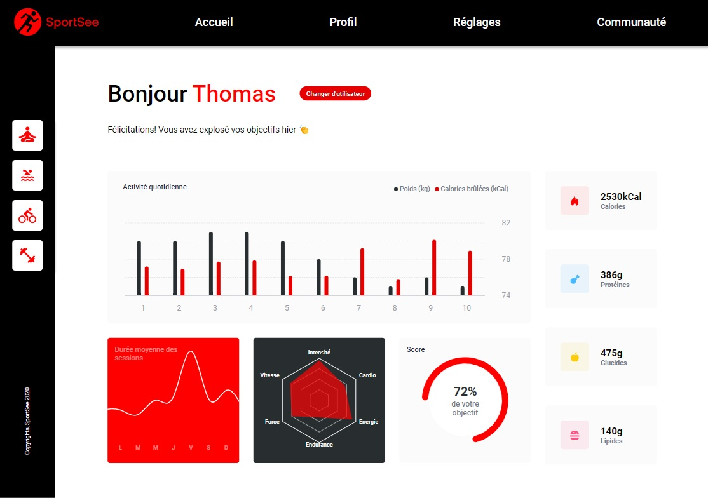

<a id="readme-top"></a>

# Sportsee



## Description

A sports analytics dashboard using React and TypeScript as part of my OpenClassrooms training, utilizing Recharts to incorporate various interactive charts.

## Installation

First fork the project:

```bash
git clone https://github.com/mrtinber/SportSee-app.git
cd SportSee-app
```

Then run npm install:

```bash
npm install
```

And then run live server:

```bash
npm run dev
```

You should be able to view the project at http://localhost:5173

## Technologies used

![React][React.js]
![Vite][Vite]
![TypeScript][TypeScript]
![Sass][Sass]

## Author

[![GitHub][GitHub]][GitHub-URL]
[![LinkedIn][LinkedIn]][LinkedIn-URL]

## Contributing

Pull requests are welcome. For major changes, please open an issue first
to discuss what you would like to change.

Please make sure to update tests as appropriate.

<p align="right">(<a href="#readme-top">back to top</a>)</p>

<!-- MARKDOWN LINKS & IMAGES -->
[React.js]: https://img.shields.io/badge/React-20232A?style=for-the-badge&logo=react&logoColor=61DAFB
[Sass]: https://img.shields.io/badge/Sass-CC6699?style=for-the-badge&logo=sass&logoColor=white
[Vite]: https://img.shields.io/badge/Vite-B73BFE?style=for-the-badge&logo=vite&logoColor=FFD62E
[TypeScript]: https://img.shields.io/badge/TypeScript-007ACC?style=for-the-badge&logo=typescript&logoColor=white
[GitHub]: https://img.shields.io/badge/GitHub-100000?style=for-the-badge&logo=github&logoColor=white
[GitHub-URL]: https://github.com/mrtinber
[LinkedIn]: https://img.shields.io/badge/LinkedIn-0077B5?style=for-the-badge&logo=linkedin&logoColor=white
[LinkedIn-URL]: https://www.linkedin.com/in/kevin-bertin/